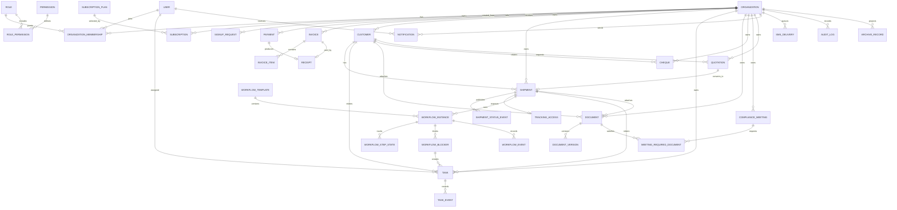

# Domain Model

## Modeling Principles

- Every tenant-owned entity belongs to one `Tenant`/`Organization`.
- Platform-owned entities, such as public plans and platform audit records, are clearly separated from tenant-owned data.
- Public tracking DTOs are projections, not direct entity exposure.
- Archive state lives on source entities through `archivedAt`; archive list/search can use a projection table or view.
- Documents are a central attachment system that can attach to shipments, customers, compliance meetings, cheques, quotations, and future entities.
- Workflow is versioned so `IR_IMPORT_CUSTOMS_V1` can coexist with future workflow templates.

Assumption: In the new model, `Company`, `Tenant`, and `Organization` are normalized into one main tenant entity named `Organization`. UI may still label it as company.

## Core Entities

### Organization

Purpose: Represents a logistics company tenant using LogisticPlus.

Main fields:

- `id`
- `name`
- `slug`
- `status`
- `planId`
- `ownerUserId`
- `contactName`
- `contactEmail`
- `contactPhone`
- `locale`
- `timezone`
- `branding`
- `createdAt`
- `updatedAt`
- `archivedAt`

Relationships:

- Has many `OrganizationMembership`
- Has one active `Subscription`
- Has many shipments, customers, documents, tasks, invoices, audit logs

Ownership rules:

- Platform owns the organization record.
- Tenant admins can edit safe tenant profile/settings fields.

Tenant isolation:

- Organization is the tenant boundary.
- Tenant-owned records reference `organizationId`.

Business rules:

- Suspended or expired organizations cannot access protected tenant APIs except billing/support-safe endpoints.
- Organization slug is globally unique.

### User

Purpose: Represents a human account.

Main fields:

- `id`
- `name`
- `email`
- `phone`
- `passwordHash`
- `status`
- `avatarUrl`
- `department`
- `locale`
- `timezone`
- `lastSeenAt`
- `twoFactorEnabled`
- `createdAt`
- `updatedAt`

Relationships:

- Has many `OrganizationMembership`
- Has many sessions/refresh tokens
- Acts on audit logs
- Can be assigned tasks, shipments, compliance meetings, cheques

Ownership rules:

- User identity is global.
- Access to tenant data happens through membership.

Tenant isolation:

- Do not infer tenant access from `user.organizationId`; use memberships.

Business rules:

- Suspended users cannot authenticate.
- Email is globally unique.
- Phone may be globally unique if SMS login requires it.

### OrganizationMembership

Purpose: Connects users to organizations with tenant-scoped roles.

Main fields:

- `id`
- `organizationId`
- `userId`
- `roleId`
- `status`
- `joinedAt`
- `invitedById`

Relationships:

- Belongs to `Organization`
- Belongs to `User`
- Belongs to `Role`

Ownership rules:

- Tenant owners/managers manage memberships subject to permission rules.
- Platform admins can support memberships with audit.

Tenant isolation:

- All tenant access checks start from an active membership.

Business rules:

- A user cannot suspend or delete their last owner/CEO membership.

### Role

Purpose: Defines permission bundles.

Main fields:

- `id`
- `organizationId` nullable for global seeded roles
- `name`
- `description`
- `isSystem`
- `createdAt`
- `updatedAt`

Relationships:

- Has many `RolePermission`
- Used by `OrganizationMembership`

Tenant isolation:

- Global roles are shared templates.
- Tenant custom roles belong to one organization.

Business rules:

- System roles cannot be deleted.

### Permission

Purpose: Atomic capability checked by guards/policies.

Main fields:

- `id`
- `key`
- `description`
- `category`

Business rules:

- Permission keys are globally unique.
- API endpoints declare required permissions.

### SubscriptionPlan

Purpose: Public/commercial SaaS plan.

Main fields:

- `id`
- `name`
- `description`
- `monthlyPrice`
- `annualPrice`
- `limits`
- `features`
- `isPublic`
- `sortOrder`

Relationships:

- Has many `Subscription`
- Referenced by signup requests

### Subscription

Purpose: Organization's active or historical plan contract.

Main fields:

- `id`
- `organizationId`
- `planId`
- `status`
- `billingCycle`
- `currentPeriodStart`
- `currentPeriodEnd`
- `limitsOverride`
- `activatedAt`
- `cancelledAt`

Business rules:

- Feature checks use plan features plus overrides.
- Expired/suspended subscriptions limit tenant access.

### Customer

Purpose: Represents a shipper/importer/customer company or contact served by a tenant.

Main fields:

- `id`
- `organizationId`
- `companyName`
- `contactName`
- `email`
- `phone`
- `address`
- `taxId`
- `nationalId`
- `notes`
- `status`
- `createdById`
- `createdAt`
- `updatedAt`
- `archivedAt`

Relationships:

- Has many shipments
- Has many documents
- Has many quotations
- Has many cheques

Tenant isolation:

- Customers are visible only inside their organization.

Business rules:

- Duplicate email/phone warnings should be tenant-scoped.

### Shipment

Purpose: Core logistics work item.

Main fields:

- `id`
- `organizationId`
- `shipmentCode`
- `customerId`
- `customerNameSnapshot`
- `status`
- `priority`
- `origin`
- `destination`
- `estimatedDeliveryAt`
- `actualDeliveryAt`
- `freeTimeEndsAt`
- `assignedManagerId`
- `createdById`
- `createdAt`
- `updatedAt`
- `completedAt`
- `archivedAt`

Relationships:

- Belongs to customer
- Has many documents
- Has many tasks
- Has many status events
- Has many workflow instances
- Has one active customer tracking access

Business rules:

- Shipment codes should be unique per tenant unless there is a business reason for global uniqueness.
- Public status is not the same as internal status.
- Shipment archive must not hard-delete workflow/tasks/documents.

### ShipmentStatusEvent

Purpose: Public/customer-visible status history.

Main fields:

- `id`
- `organizationId`
- `shipmentId`
- `publicLabel`
- `publicDescription`
- `isCustomerVisible`
- `createdById`
- `createdAt`

Business rules:

- Only customer-visible events can appear in public tracking.

### TrackingAccess

Purpose: Controls public customer tracking links/search access.

Main fields:

- `id`
- `organizationId`
- `shipmentId`
- `tokenHash`
- `enabled`
- `createdById`
- `createdAt`
- `disabledAt`
- `lastViewedAt`

Business rules:

- Store only token hash.
- Show raw token only immediately after generation.
- Reset invalidates previous token.

### WorkflowTemplate

Purpose: Versioned workflow definition such as Iran import customs.

Main fields:

- `id`
- `key`
- `version`
- `name`
- `description`
- `status`
- `definitionJson`
- `createdAt`

Relationships:

- Has many workflow instances.

Business rules:

- Existing workflow instances keep their template version.

### WorkflowInstance

Purpose: A shipment's active/completed workflow.

Main fields:

- `id`
- `organizationId`
- `shipmentId`
- `workflowTemplateId`
- `status`
- `currentStepCode`
- `route`
- `startedById`
- `startedAt`
- `completedAt`

Relationships:

- Has many step states
- Has many blockers
- Has many workflow events
- Can generate tasks

### WorkflowStepState

Purpose: Stores per-shipment step state.

Main fields:

- `workflowInstanceId`
- `stepCode`
- `status`
- `isVisible`
- `isExceptional`
- `internalNote`
- `publicNote`
- `completedById`
- `completedAt`

Business rules:

- Public DTO may use `publicNote`; never expose `internalNote`.

### WorkflowBlocker

Purpose: Tracks operational exceptions/blockers.

Main fields:

- `id`
- `organizationId`
- `workflowInstanceId`
- `shipmentId`
- `stepCode`
- `blockerCode`
- `status`
- `internalNote`
- `publicNote`
- `createdById`
- `resolvedById`
- `resolvedAt`

Business rules:

- Open blockers can block workflow completion.
- Resolving blocker writes workflow event and optional task event.

### Task

Purpose: Assignable work item.

Main fields:

- `id`
- `organizationId`
- `title`
- `description`
- `status`
- `priority`
- `assignedToId`
- `assignedById`
- `assignedAt`
- `dueAt`
- `sourceType`
- `sourceId`
- `shipmentId`
- `customerId`
- `workflowInstanceId`
- `workflowStepCode`
- `workflowBlockerId`
- `completedAt`
- `completedById`
- `createdAt`
- `updatedAt`

Business rules:

- All assignment/status changes create `TaskEvent`.
- Users with own-task permission see only assigned tasks.

### TaskEvent

Purpose: Assignment and status history for tasks.

Main fields:

- `id`
- `organizationId`
- `taskId`
- `actorUserId`
- `eventType`
- `fromAssigneeId`
- `toAssigneeId`
- `fromStatus`
- `toStatus`
- `note`
- `createdAt`

### Document

Purpose: Metadata for uploaded file and current version.

Main fields:

- `id`
- `organizationId`
- `title`
- `type`
- `fileName`
- `mimeType`
- `fileSizeBytes`
- `checksum`
- `currentVersion`
- `storageObjectKey`
- `visibility`
- `uploadedById`
- `shipmentId`
- `customerId`
- `meetingId`
- `chequeId`
- `quotationId`
- `createdAt`
- `updatedAt`
- `archivedAt`

Business rules:

- Public access only if `visibility = customer_visible` and related shipment tracking is enabled.

### DocumentVersion

Purpose: Version history for documents.

Main fields:

- `id`
- `organizationId`
- `documentId`
- `version`
- `storageObjectKey`
- `fileName`
- `mimeType`
- `fileSizeBytes`
- `checksum`
- `uploadedById`
- `createdAt`

### Cheque

Purpose: Finance workflow item for cheque tracking.

Main fields:

- `id`
- `organizationId`
- `bankName`
- `chequeNumber`
- `amount`
- `currency`
- `dueDate`
- `location`
- `receiver`
- `status`
- `assignedToId`
- `customerId`
- `description`
- `createdById`
- `archivedAt`

Business rules:

- Cheque numbers should be unique per tenant, not per owner user.

### ComplianceMeeting

Purpose: Tracks official/compliance meetings and required documents.

Main fields:

- `id`
- `organizationId`
- `title`
- `meetingAt`
- `location`
- `status`
- `assignedToId`
- `description`
- `outcome`
- `nextActionItems`
- `reminderSent`
- `relatedCustomerId`
- `relatedShipmentId`
- `archivedAt`

### MeetingRequiredDocument

Purpose: Checklist item for compliance meeting documents.

Main fields:

- `id`
- `organizationId`
- `meetingId`
- `name`
- `required`
- `completed`
- `documentId`

### Quotation

Purpose: Sales/price quote that can convert to shipment.

Main fields:

- `id`
- `organizationId`
- `quotationNumber`
- `customerId`
- `customerNameSnapshot`
- `originCity`
- `destinationCity`
- `cargoType`
- `weight`
- `dimensions`
- `pickupDate`
- `deliveryDate`
- `requirements`
- `baseRate`
- `fuelSurcharge`
- `loadingFees`
- `tollFees`
- `insurancePercentage`
- `profitMargin`
- `totalPrice`
- `validUntil`
- `status`
- `convertedShipmentId`
- `archivedAt`

### Invoice

Purpose: Tenant billing invoice.

Main fields:

- `id`
- `organizationId`
- `subscriptionId`
- `invoiceNumber`
- `status`
- `currency`
- `subtotal`
- `tax`
- `total`
- `dueAt`
- `issuedAt`
- `paidAt`
- `voidedAt`

### Payment

Purpose: Payment attempt or manual payment record.

Main fields:

- `id`
- `organizationId`
- `subscriptionId`
- `signupRequestId`
- `provider`
- `status`
- `amount`
- `currency`
- `gatewayAuthority`
- `gatewayRefId`
- `gatewayUrl`
- `requestedAt`
- `verifiedAt`
- `failedAt`
- `manualOverride`
- `markedById`

Business rules:

- Provider callbacks must be idempotent.

### Notification

Purpose: In-app notification.

Main fields:

- `id`
- `organizationId`
- `userId`
- `title`
- `body`
- `type`
- `sourceType`
- `sourceId`
- `readAt`
- `createdAt`

### SmsDelivery

Purpose: Queue/audit record for SMS messages.

Main fields:

- `id`
- `organizationId`
- `recipientType`
- `recipientName`
- `recipientPhone`
- `message`
- `status`
- `provider`
- `sourceType`
- `sourceId`
- `eventKey`
- `attemptCount`
- `nextAttemptAt`
- `providerMessageId`
- `sentAt`
- `failedAt`

### AuditLog

Purpose: Append-only record of security/business mutations.

Main fields:

- `id`
- `organizationId`
- `actorUserId`
- `action`
- `entityType`
- `entityId`
- `summary`
- `beforeJson`
- `afterJson`
- `ipAddress`
- `userAgent`
- `requestId`
- `createdAt`

Business rules:

- Audit logs are append-only.
- Public/customer APIs never expose audit logs.

### ArchiveRecord

Purpose: Search/list projection for archived records.

Main fields:

- `id`
- `organizationId`
- `entityType`
- `entityId`
- `title`
- `summary`
- `archivedById`
- `archivedAt`
- `restoredAt`

Business rules:

- Source table `archivedAt` is canonical.
- Projection updates happen in the same transaction as source archive/restore.

## Mermaid ERD

## Decision Needed

- Decide whether one user can belong to multiple tenant organizations in MVP. Recommendation: design for it now even if UI initially supports one active tenant.
- Decide whether archive projection should be a table, materialized view, or normal SQL view. Recommendation: table for search/permanent-delete workflow compatibility.
- Decide whether workflow templates are platform-managed only at MVP or tenant-customizable.

